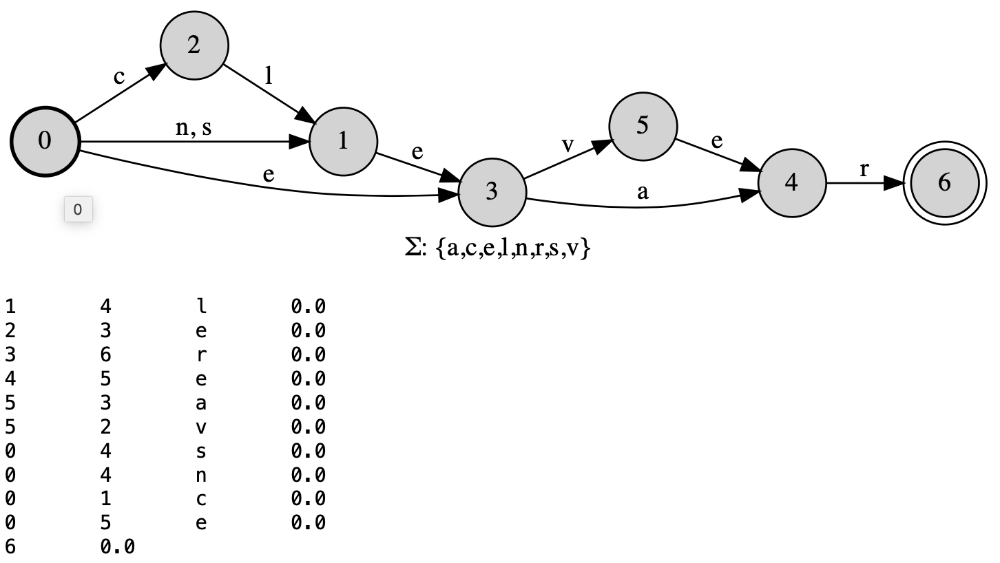

# PyFoma
Python Finite-State Toolkit

__PyFoma__ is a an open source (Apache) package for finite-state automaton and transducer modeling and learning. It is implemented entirely in Python with no external dependencies.

__PyFoma__ supports:

- [Compiling both weighted and unweighted automata](./docs/RegularExpressionCompiler.ipynb) and transducers (FSMs) from Perl/Python-like regular expressions.
- All the standard weighted and unweighted automata algorithms: epsilon-removal, determinization, minimization, composition, shortest-path algorithms, extraction of strongly connected components, (co)accessibility, etc.
- Weights in the _tropical semiring_ for automata and transducer construction both for low-level construction methods and regular expressions.
- Integration with Jupyter-style notebooks for automata visualization and debugging.
- Custom extensions to the regular expression parser and compiler using Python.
- [Compilation of morphological lexicons](./docs/MorphologicalAnalyzerTutorial.ipynb) as weighted or unweighted right-linear grammars, similarly to the [lexc](https://fomafst.github.io/morphtut.html#The_lexc-script)-formalism.
- A comprehensive replacement-rule formalism to construct string-rewriting transducers.

The PyFoma implementation aims at a level of abstraction where most major finite-state algorithms are implemented clearly and asymptotically optimally in what resembles canonical pseudocode, so the code itself could be used for instructional purposes. Additionally, many algorithms can illustrate how they work. The regular expression and right-linear grammar formalisms are intended to be accessible to linguists and computer scientists alike.

----

## History

As a tool, PyFoma is unrelated to the [__foma__](https://fomafst.github.io) compiler, which is implemented in C and uses the Xerox formalism for regular expressions and which has its own Python extensions, but it inherits many of its FSM construction algorithms. The regular expression formalism is influenced by [The Kleene Programming Language](http://www.kleene-lang.org/).

----

## Quickstart

* Build weighted and unweighted automata and transducers from regular expressions:

```python
from pyfoma import FST
myfst = FST.re("(cl|n|s)?e(ve|a)r")
myfst.view()
```


* ... or through low-level specification

```python
from pyfoma import FST, State

myfst = FST()            # Init object
s0 = myfst.initialstate  # FST() always has one state, make that s0
s1 = State()             # Add a state
s0.add_transition(s1, ("a","x"), 1.0)  # Add transitions...
s0.add_transition(s1, ("a","y"), 2.0)
s1.add_transition(s0, ("a","a"), 0.0)
s1.finalweight = 2.0                   # Set the final weight
myfst.states = {s0,s1}                 # Set of states
myfst.finalstates = {s1}               # Set of final states
myfst.alphabet = {"a","x","y"}         # Optional alphabet
myfst.view()
list(myfst.generate("aaa", weights = True))
```


* ... or using a [visual tool](https://verbs.colorado.edu/~mahu0110/fsmdesign/)


* Access basic algorithms such as determinization, minimization, weight pushing, shortest path, etc. 
Every algorithm has a *mutating* form and a *non-mutating* form.

```python
from pyfoma.algorithms import pushed_weights # Only needed for non-mutating alg

fst = pushed_weights(fst) # Non-mutating
# ===== OR =====
fst.push_weights() # Mutating

fst.view()
print(fst)    # Also print in AT&T string format
```



* Construct models of phonology and morphophonology with replacement rule transducers:

```python
nasal = FST.re("[mnŋ]")  # Define nasals for reuse in rule
nasalization = FST.re("$^rewrite(a:'ã'|e:'ẽ'|i:'ĩ'|o:'õ'|u:'ũ' / _ $nasal)", {'nasal': nasal})
nasalization.view()
list(nasalization.generate("foma"))  # Pass word through transducer, returns generator
```


----

## Documentation

* [Regular expression compiler](./docs/RegularExpressionCompiler.ipynb)
* [Morphological Analyzer Tutorial](./docs/MorphologicalAnalyzerTutorial.ipynb)
* [Algorithms overview](./docs/Algorithms.ipynb)

* Example code:
   * [The Soundex Algorithm](./docs/Example%20-%20Soundex.ipynb)
