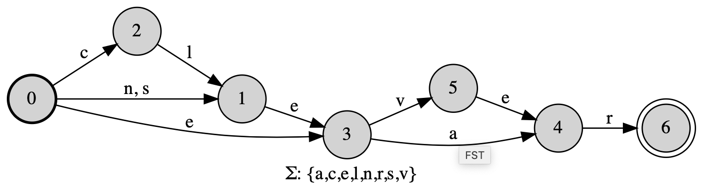
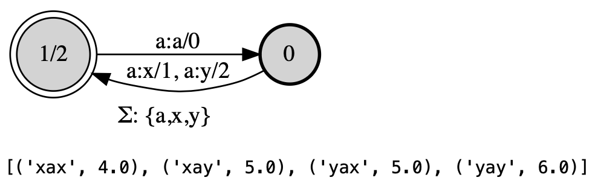
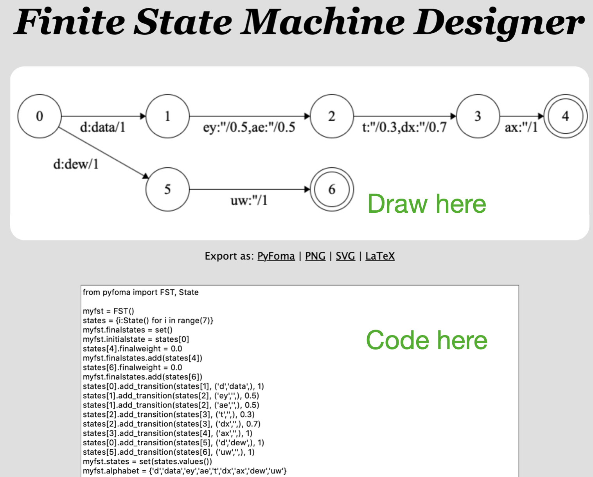
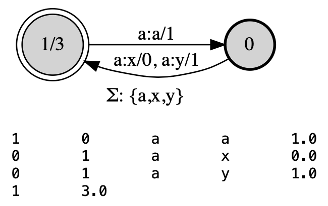
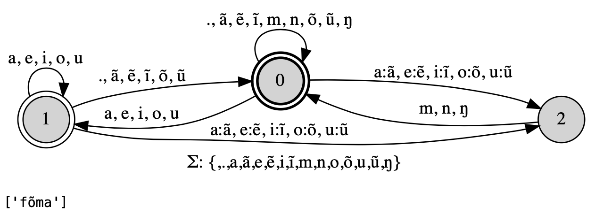

Getting Started
===============

.. code-block:: guess

   # pyfoma requires Python >= 3.6
   pip install pyfoma

Build weighted and unweighted automata and transducers from regular expressions, using the :any:`FST.re` constructor:

.. code-block:: python

   from pyfoma import FST
   myfst = FST.re("(cl|n|s)?e(ve|a)r")
   myfst.view()

... or through low-level specification, using the default :class:`FST` constructor and :py:meth:`add_transition`:

.. code-block:: python

   from pyfoma import FST, State

   myfst = FST()            # Init object
   s0 = myfst.initialstate  # FST() always has one state, make that s0
   s1 = State()             # Add a state
   s0.add_transition(s1, ("a","x"), 1.0)  # Add transitions...
   s0.add_transition(s1, ("a","y"), 2.0)
   s1.add_transition(s0, ("a","a"), 0.0)
   s1.finalweight = 2.0                   # Set the final weight
   myfst.states = {s0,s1}                 # Set of states
   myfst.finalstates = {s1}               # Set of final states
   myfst.alphabet = {"a","x","y"}         # Optional alphabet
   myfst.view()
   list(myfst.generate("aaa", weights = True))

... or using a `visual tool <https://verbs.colorado.edu/~mahu0110/fsmdesign/>`_

==============
FST algorithms
==============

Access basic algorithms such as determinization, minimization, weight pushing, shortest path, etc. Every algorithm has a _mutating_ form and a _non-mutating_ form.

.. code-block:: python

   from pyfoma.algorithms import pushed_weights # Only needed for non-mutating alg

   fst = pushed_weights(fst) # Non-mutating
   # ===== OR =====
   fst.push_weights() # Mutating

   fst.view()
   print(fst)    # Also print in AT&T string format

=================
Replacement rules
=================

Construct models of phonology and morphophonology with replacement rule transducers:

.. code-block:: python

   nasal = FST.re("[mnŋ]")  # Define nasals for reuse in rule
   nasalization = FST.re("$^rewrite(a:'ã'|e:'ẽ'|i:'ĩ'|o:'õ'|u:'ũ' / _ $nasal)", {'nasal': nasal})
   nasalization.view()
   list(nasalization.generate("foma"))  # Pass word through transducer, returns generator

